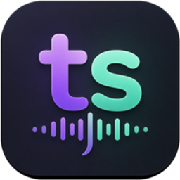

# typesass



Official website: <https://typesass.tolern.com/>

typesass is a lightweight desktop speech-to-text assistant for dictation,
translation, quick Q&A, and automatic paste workflows. It is built with Tauri,
Vite, and TypeScript, and currently uses Xiaomi Mimo-compatible OpenAI-style
API endpoints for ASR and text generation.

## 中文说明

typesass 是一款轻量级桌面语音转文字助手，面向日常口述输入、语音翻译、随口提问和自动粘贴工作流。当前版本基于 Tauri、Vite 和 TypeScript 构建，并使用兼容 OpenAI 风格的小米 Mimo API 端点完成语音识别和文本生成。

### 功能特性

- 通过全局快捷键开始录音。
- 语音转文字后，可选择使用 AI 自动润色口述内容。
- 支持语音翻译，并把结果自动粘贴到当前输入框。
- 支持语音提问，结果在本地 Hub 中展示。
- 支持本地历史、词典、设置和托盘菜单。
- API Key 不写入源码，桌面端可存储到 macOS 钥匙串。

### 下载状态

- macOS: 已提供 `0.0.1` 版本安装包。
- Windows: 开发中。

## Features

- Start recording from a global shortcut.
- Transcribe speech, then optionally polish the dictated text with AI.
- Translate spoken content and paste the result into the active input field.
- Ask quick voice questions and view the answer in the local hub.
- Keep local history, dictionary entries, settings, and tray-menu workflows.
- Store API credentials outside the source code.

## Default Shortcuts

| Action | Shortcut |
| --- | --- |
| Dictation | `Control + P` |
| Translation | `Control + T` |
| Ask | `Control + Space` |

## Requirements

- Node.js 20 or later
- npm
- Rust and Cargo for the Tauri desktop app
- A Xiaomi Mimo API key

## Downloads

- macOS: `0.0.1` is available from GitHub Releases.
- Windows: in development.

## Web Preview

Use the web preview when Rust/Cargo is not installed yet:

```bash
npm install
npm run build
npm run preview:web
```

Open the URL printed in the terminal, enter your Mimo API key, and start
recording.

You can also provide the key through an environment variable:

```bash
MIMO_API_KEY=your_api_key npm run preview:web
```

## Desktop Development

Install Rust first, then run the Tauri app:

```bash
npm install
npm run dev
```

You can also provide the key through an environment variable:

```bash
MIMO_API_KEY=your_api_key npm run dev
```

Build the desktop app:

```bash
npm run tauri:build
```

## Default Model Configuration

| Setting | Value |
| --- | --- |
| Base URL | `https://token-plan-cn.xiaomimimo.com/v1` |
| ASR model | `mimo-v2.5-asr` |
| AI model | `mimo-v2.5` |
| Language | Auto detect |

## Privacy And Security

typesass does not hard-code API keys and does not store them in `localStorage`.
On macOS, keys entered in the desktop settings page are stored in Keychain. You
can also provide `MIMO_API_KEY` at runtime if you prefer environment-based
configuration.

## Repository Mirrors

This project is mirrored as:

- GitHub: `typesass`
- Alibaba Cloud Codeup: `aiTool`

The local `origin` remote is configured to keep the Codeup repository as the
fetch source and push to both Codeup and GitHub.

## License

MIT
